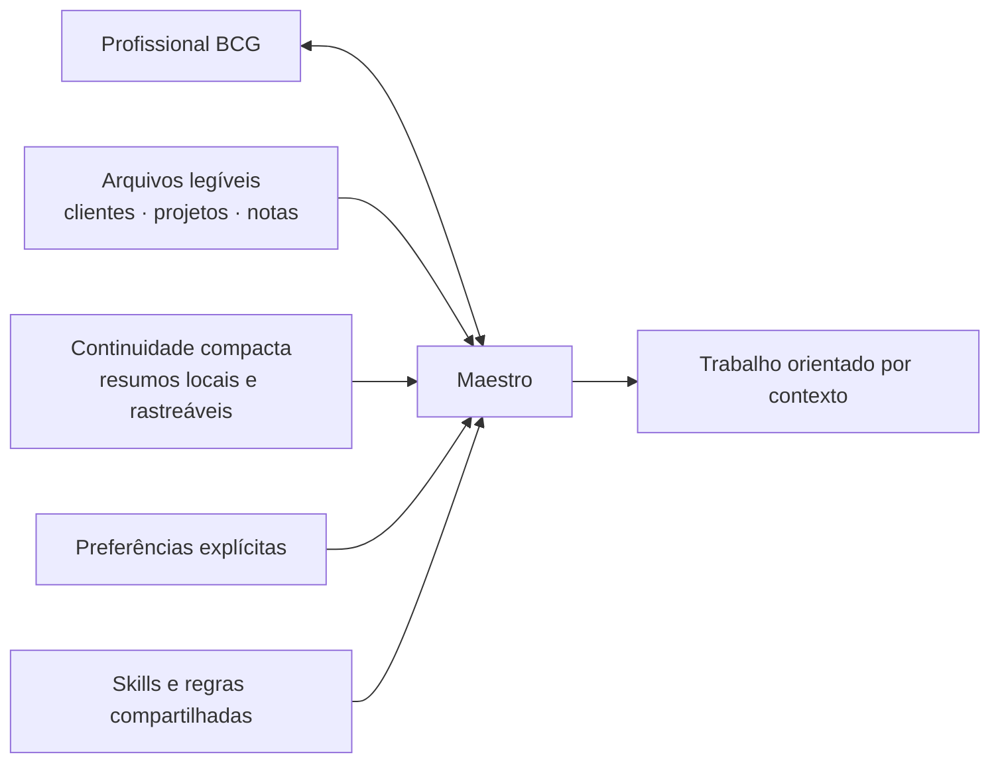
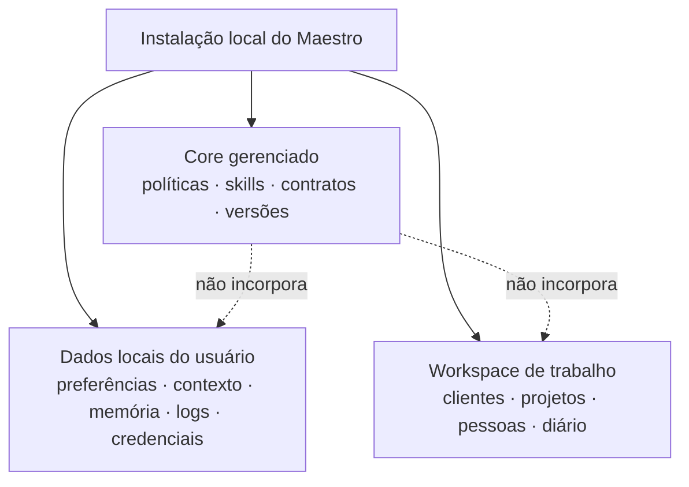

# Maestro

> O Second Brain profissional do BCG Brasil: contexto de trabalho que uma pessoa consegue navegar e agentes conseguem usar com segurança.

Maestro é o nome do produto. O repositório continua `bcg-brasil-agentic-os` e
o comando técnico continua `bcgos` durante a fundação do piloto, para não
quebrar contribuições, scripts ou futuros instaladores.

## O que estamos construindo

Maestro ajuda consultores, times BCG X, cientistas de dados e engenheiros a
organizar trabalho profissional e trabalhar melhor com agentes. Ele combina:



Uma pessoa deve conseguir abrir seus arquivos e encontrar o contexto por conta
própria. O agente deve receber apenas o contexto necessário para a tarefa, sem
transformar documentos inteiros, conversas ou dados de cliente em prompt.

## Para quem

O primeiro piloto é para pessoas com níveis técnicos muito diferentes. A
experiência-alvo é alguém que quer começar a trabalhar, não aprender Git,
Python, Go, Docker ou arquitetura de agentes.

- **Consultor:** linguagem simples, caminho recomendado e contexto de caso
  navegável.
- **Usuário avançado:** opções e diagnósticos extras quando pedir.
- **Usuário power:** detalhes técnicos e alternativas aprovadas, sem receber
  permissões extras.

Windows e macOS são plataformas de primeira classe do piloto. Claude é o
runtime principal; Codex deve preservar os mesmos contratos e limites, mesmo
quando os mecanismos nativos forem diferentes.

## O que já existe

| Capacidade | Estado atual |
| --- | --- |
| Workspace local | `bcgos init`, `status` e `doctor` criam e inspecionam o espaço sem misturar dados de trabalho ao core gerenciado. |
| Agente do workspace | Entrevista e briefing versionado, pesquisa pública aprovada e dossiê isolado por projeto; sandbox rígido dos runtimes ainda está pendente. |
| Core de agentes | Catálogo canônico de Maestro, Walter e Darwin com hub sem tools, múltiplas cadeias governadas, uma branch ativa e profundidade 2 por papel; ativação nativa ainda está pendente. |
| Preferência de interação | `standard`, `advanced` e `power`, configuradas localmente e sem alterar permissões. |
| Contexto do dono | Arquivos locais, editáveis e auditáveis para papel profissional, estilo, voz, preferências e limites. |
| Atlas humano | Estrutura local não destrutiva para clientes, projetos, pessoas e diário de trabalho. |
| Memória | Núcleo local com resumos graduais e contexto limitado; automação de síntese ainda não está ativa. |
| Execução retomável | Ledger local com contrato imutável, checkpoint privado, pausa/retomada, projeção compacta, receipts de checks executados pelo core e conclusão revalidada. |
| Skills | Catálogo compacto e atualizado de procedimentos disponíveis. |
| Desenvolvimento | Harness, testes, CI em Windows/macOS/Linux, decisões versionadas e fluxo de PR com revisão humana. |

## O que ainda não existe

Maestro ainda **não** está pronto para distribuição ao piloto. Ainda faltam,
entre outros:

- instalador e atualizações seguras para usuários finais;
- releases assinados e autenticação de distribuição;
- hooks de produto para Claude e Codex;
- ativação nativa do core Maestro/Walter/Darwin com enforcement de tools e delegação;
- memória automática, busca e Wiki compilada;
- ingestão de documentos com Docling empacotado;
- sincronização com ferramentas de tarefas.
- enforcement de isolamento por hooks nos runtimes Claude e Codex.

Nenhuma dessas capacidades deve ser presumida por documentação ou por um
agente até ter contrato, testes e validação explícitos.

## Como os dados ficam separados



Dados de cliente, pessoas, conversas, memória, credenciais e arquivos reais
nunca pertencem ao repositório ou a bundles distribuídos. O usuário escolhe o
diretório do workspace; a recomendação forte é usar uma pasta local fora de
OneDrive e outros diretórios sincronizados.

## Comandos atuais

Estes comandos existem para desenvolvimento e testes locais; a instalação de
usuário final ainda está em construção.

```text
bcgos init <workspace>
bcgos doctor <workspace>
bcgos profile show
bcgos owner init
bcgos atlas init <workspace>
bcgos atlas status <workspace>
bcgos workspace-agent interview <workspace>
bcgos workspace-agent status <workspace>
bcgos skills index
bcgos session packet [workspace]
bcgos session bridge --runtime claude|codex [workspace]
bcgos work create --workspace <path> --stdin
bcgos work start --workspace <path> --item <id> --revision <n>
bcgos work checkpoint --workspace <path> --item <id> --revision <n> --attempt <id> --stdin
bcgos work pause --workspace <path> --item <id> --revision <n> --attempt <id>
bcgos work next --workspace <path> (--item <id> | --active)
bcgos work resume --workspace <path> --item <id> --revision <n>
bcgos work evidence --workspace <path> --item <id> --revision <n> --attempt <id> --criterion <id>
bcgos work complete --workspace <path> --item <id> --revision <n> --attempt <id>
bcgos work inspect --workspace <path> --item <id>
bcgos work export --workspace <path> --item <id>
bcgos work delete --workspace <path> --item <id> --revision <n> --confirm
```

Os comandos de memória expõem apenas operações já suportadas. O pacote de
contexto de sessão expõe estados e referências limitadas, sem injetar conteúdo.
Dreaming automático e injeção em runtime dependem de adapters que ainda estão
sendo entregues ou revisados. Os comandos `work` implementam handoff e conclusão
local evidence-backed, mas não são task sync nem generic tracing. Checkpoints
entram somente por stdin e `next` devolve no máximo 2 KB sem reinjetar o objetivo
ou o contrato de conclusão. Mutações e checks devolvem somente recibos técnicos;
corpos completos exigem uma chamada explícita a `inspect` ou `export`.
Checks Go usam a ferramenta identificada do runtime e ambiente fechado, mas
`go test` ainda executa código do workspace e pressupõe que esse workspace foi
autorizado pelo usuário como confiável; isso não constitui sandbox.

## Princípios de produto

1. **Trabalho profissional apenas.** Maestro não é um sistema para vida
   pessoal, finanças ou outros domínios fora do BCG.
2. **Baixa fricção.** O sistema deve guiar a pessoa, não exigir experiência de
   desenvolvimento.
3. **Arquivos legíveis primeiro.** O usuário pode abrir e corrigir seu próprio
   contexto.
4. **Contexto limitado e rastreável.** O agente recebe resumos e ponteiros,
   não um despejo de dados.
5. **Privacidade por escopo.** Conteúdo gerenciado, pessoal e de workspace não
   se confundem.
6. **Claude-first, Codex-compatible.** A experiência pode variar, mas os
   contratos importantes não.
7. **Hub enxuto.** Maestro não usa tools e coordena múltiplas cadeias
   governadas, mantendo uma branch ativa por padrão e profundidade máxima 2
   somente por arestas de papel autorizadas.
8. **Evolução governada.** Mudanças estruturais precisam de decisão, teste e
   revisão humana.

## Para contribuir

O repositório é a fábrica; não é a instalação do usuário final. Um
contribuidor começa por [CONTRIBUTING.md](CONTRIBUTING.md). No Claude, diga:

> Use `start-contributing` e me guie passo a passo.

Antes de abrir um PR, rode:

```text
go run ./dev/harness validate --full
```

Use o [template de PR](.github/pull_request_template.md) para deixar claro o
resultado, testes, limites de dados e o que ficou fora do escopo. Decisões
duráveis usam um código de quatro letras no
[decision log](docs/decisions/decision-log.md).

## Onde se aprofundar

- [Roadmap](ROADMAP.md)
- [Contrato de colaboração](COLLAB.md)
- [Decisões do projeto](docs/decisions/decision-log.md)
- [Arquitetura de memória](specs/006-memory-persistence.md)
- [Navegação e Wiki](specs/007-content-navigation.md)
- [Contexto profissional do dono](specs/013-owner-context.md)
- [Atlas humano](specs/014-human-atlas-bootstrap.md)
- [Fronteiras do agente de workspace](specs/016-workspace-agent-boundaries.md)
- [Inicialização e pesquisa do agente](specs/017-workspace-agent-initialization.md)
- [Core de agentes do Maestro](specs/018-maestro-core-agents.md)
- [Visualização da governança de agentes](docs/visualizations/maestro-agent-governance.md)

## Confidencialidade

Este repositório privado armazena código, templates, contratos e conteúdo
sanitizado distribuível. Nunca faça commit de material de cliente, dados
pessoais, credenciais, conversas, memória operacional ou arquivos de trabalho.
