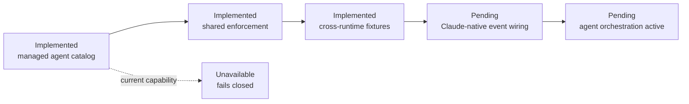

# Claude product adapter

This is the thin product adapter boundary for Claude. Policies, memory and
capability states remain canonical in `bundles/base/runtime/capabilities.json`.

Current state: `bcgos doctor` discovers a local Claude executable, while every
product lifecycle event remains explicitly unavailable. `bcgos session bridge
--runtime claude [workspace-path]` supplies a bounded Session Start envelope
for a future adapter to consume; it does not install a hook or inject content.
Development hooks under `.claude/` are not product adapter wiring.

The managed Maestro, Walter and Darwin definitions live in
`bundles/base/agents/`. `internal/agentorchestration` now provides the shared
fail-closed controller, and the Claude envelope maps `agent_branch_start`,
`agent_child_start`, `pre_tool_use`, `agent_child_stop` and
`agent_branch_stop` to its semantic events. The shared conformance fixture
proves equivalent decisions with Codex, including forged identities, scopes
and unregistered targets. Events require capability-bound agent identities and
exact tool/resource grants. A shared recoverable state snapshot prevents a
second adapter instance from opening a parallel branch. These are not active
Claude agents yet: installed native event wiring and durable state persistence
are still required before `agent_orchestration` can move from `unavailable`.

Future wiring may map Claude-native mechanisms to `session_start`,
`pre_action_guard`, `post_action_observe`, `stop_finalize` and
`context_inject`. It must add conformance fixtures before changing a capability
state. At Session Start it must also resolve the user-local interaction profile
and inject only its bounded ID and managed policy pointer; the profile must not
be derived from or persisted into memory.
