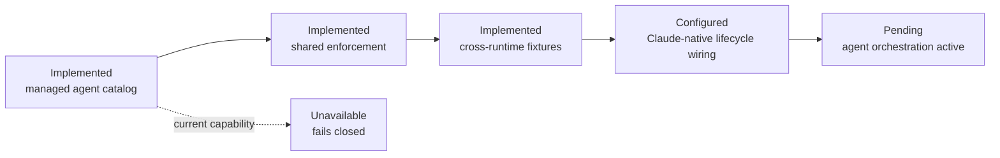

# Claude product adapter

This is the thin product adapter boundary for Claude. Policies, memory and
capability states remain canonical in `bundles/base/runtime/capabilities.json`.

Current implementation: workspace-local configuration maps Claude
`SessionStart`, `UserPromptSubmit`, `PreToolUse`, `PostToolUse` and `Stop` to
the canonical lifecycle. Session and context output stay bounded and
pointer-only. The guard fails closed on invalid input and denies only the
implemented protected-root deletion policy. Post/stop entries are asynchronous
and emit metadata-only local receipts.

Every product lifecycle event remains explicitly `unavailable` in the
capability manifest. `bcgos doctor` diagnoses configuration and receipts
separately. A receipt is marked `adapter_command`: it proves the bounded
Maestro command ran, not that Claude invoked it in a qualifying native session.
The lifecycle probe also blocks native qualification below Claude `2.1.177`
and reports the evidence class for each event. See Spec 035 and
`docs/lifecycle-readiness.md` for the evidence matrix.

The managed Maestro, Case, Client Account, PA Expert, Walter and Darwin definitions live in
`bundles/base/agents/`. `internal/agentorchestration` now provides the shared
fail-closed controller, and the Claude envelope maps `agent_branch_start`,
`agent_child_start` (legacy denial only), `pre_tool_use`, `agent_child_stop` and
`agent_branch_stop` to its semantic events. The shared conformance fixture
proves equivalent decisions with Codex, including forged identities, scopes
and unregistered targets. Events require capability-bound agent identities and
exact tool/resource grants. A shared durable Maestro state store prevents a
second adapter instance from opening a parallel branch and is shared with
Codex. Native qualification still requires fresh session evidence.

Walter review wiring is shared with Codex through `internal/agentdispatch`:
the Claude adapter only forwards a sealed Walter packet and typed verdict to
that core. Walter is Maestro's internal Senior Advisor & Refiner: calm,
precise and constructive, with at most three load-bearing objections. A
blocking refinement must include a concrete fix and acceptance condition;
cosmetic preferences cannot block. Walter has no tools, delegation or direct
user channel. The execution-ledger bridge uses installation-scoped
`maestro/walter-review` custody, distinct from release signing; missing,
stale, replayed or cross-scope custody fails closed. Adapter-command receipts
remain diagnostic until native evidence exists.

The packet also carries a digest-bound IntentReviewPacket: literal prompt,
Maestro route, bounded draft, Owner Context snapshot version/digest and
relevant metadata-only observation references. Walter returns a typed purpose
hypothesis with evidence and confidence; low confidence at high consequence
returns `clarify`. Neither adapter may persist a hypothesis or write Owner
Context; both call the same core.

Maestro resolves two independent decisions: `account_consultation_required`
for client/stakeholder strategic lens, and `walter_required` for high-leverage
output. Account-assisted work proves Account framing → Case → Account
validation; direct Case work proves an execution-only/no-client-lens reason and
does not call Account. Both routes return to Maestro, and only a required
Walter approval—or an explicit low-leverage `walter_skipped` receipt—can reach
the final response.

The lifecycle wiring maps `session_start`, `pre_action_guard`,
`post_action_observe`, `stop_finalize` and `context_inject`, but conformance
evidence is still required before any capability-state change. Session Start
resolves the user-local interaction profile and injects only its bounded ID and
managed policy pointer; the profile is not derived from or persisted into
memory.

Darwin 🧬 is the governance surgeon, not a separate housekeeping agent. The
runtime-neutral `internal/darwin` contract accepts the same bounded packet in
interactive and `headless_housekeeping` modes, applies only the signed
`health/maestro-system` grants and persists metadata-only receipts. Claude
native invocation of that seam remains unavailable until a qualifying native
session observes it.
