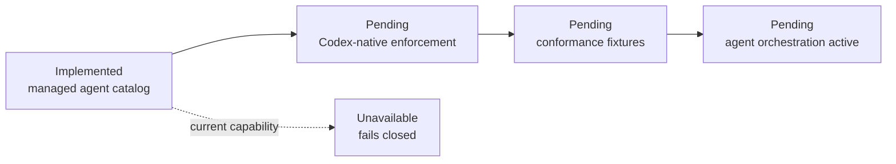

# Codex product adapter

This is the thin product adapter boundary for Codex. Policies, memory and
capability states remain canonical in `bundles/base/runtime/capabilities.json`.

Current state: `bcgos doctor` discovers a local Codex executable, while every
product lifecycle event remains explicitly unavailable. `bcgos session bridge
--runtime codex [workspace-path]` supplies the same bounded Session Start
envelope for a future adapter to consume; it does not install a hook or inject
content. Codex must not inherit Claude-specific development hooks as a product
capability.

The managed Maestro, Walter and Darwin definitions live in
`bundles/base/agents/`. They are not active Codex agents yet. Activation must
prove no-tool Maestro, one active branch, one child per agent and the
role-gated depth-two graph before `agent_orchestration` can move from
`unavailable`.

Future wiring may map Codex-native mechanisms to `session_start`,
`pre_action_guard`, `post_action_observe`, `stop_finalize` and
`context_inject`. It must add conformance fixtures before changing a capability
state. At Session Start it must also resolve the user-local interaction profile
and inject only its bounded ID and managed policy pointer; the profile must not
be derived from or persisted into memory.
