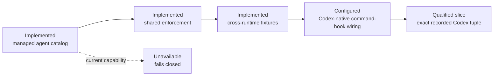

# Codex product adapter

This is the thin product adapter boundary for Codex. Policies, memory and
capability states remain canonical in `bundles/base/runtime/capabilities.json`.

Current state: the installed `bcgos workspace` control plane can enroll an
ordinary Git repository or linked worktree for Codex and project five bounded
workspace-local command hooks using the absolute installed CLI path. This is
implemented, locally contract-tested and natively qualified for the exact
Codex CLI 0.149.1 / `gpt-5.6-sol` / post-initialization isolated-config digest / macOS
arm64 / unsigned v0.1.11 ZIP tuple recorded under `docs/evidence/`. Codex must
still review workspace hooks through `/hooks` in
ordinary use and must not inherit Claude-specific development hooks as a
product capability.

Evidence snapshot: `as_of: 2026-08-25` · source baseline:
`00617f3af0beab729679ac03e077d3a898b814ab` (`origin/main` at review start) ·
runtime evidence: the bounded record
`docs/evidence/codex-direct-macos-arm64-0.1.11-2026-08-25.json` qualifies the
direct projection only for the exact model/config/runtime/platform/artifact
tuple it names. The
qualification used synthetic fixtures, `--approve-for-me`, workspace-write
sandboxing and a bypass only of the already inspected hook-trust prompt. It
does not establish `release-ready` or `pilot-ready`.

The managed Maestro, Case, Client Account, PA Expert, Yoda and Darwin definitions live in
`bundles/base/agents/`. `internal/agentorchestration` now provides the shared
fail-closed controller, and the Codex envelope maps
`collaboration_branch_start`, `collaboration_child_start` (legacy denial only), `tool_call_guard`,
`collaboration_child_stop` and `collaboration_branch_stop` to its semantic
events. The shared conformance fixture proves equivalent decisions with
Claude, including forged identities, scopes and unregistered targets. Events
require capability-bound agent identities and exact tool/resource grants. A
shared durable Maestro state store prevents a second adapter instance from
opening a parallel branch and is shared with Claude. Native qualification still
requires fresh session evidence.

Yoda review wiring is shared with Claude through `internal/agentdispatch`:
the Codex adapter only forwards a sealed Yoda packet and typed verdict to
that core. Yoda is Maestro's internal Senior Advisor & Refiner: calm,
precise and constructive, with at most three load-bearing objections. A
blocking refinement must include a concrete fix and acceptance condition;
cosmetic preferences cannot block. Yoda has no tools, delegation or direct
user channel. The execution-ledger bridge uses installation-scoped
`maestro/yoda-review` custody, distinct from release signing; missing,
stale, replayed or cross-scope custody fails closed. Adapter-command receipts
remain diagnostic until native evidence exists.

The packet also carries a digest-bound IntentReviewPacket: literal prompt,
Maestro route, bounded draft, Owner Context snapshot version/digest and
relevant metadata-only observation references. Yoda returns a typed purpose
hypothesis with evidence and confidence; low confidence at high consequence
returns `clarify`. Neither adapter may persist a hypothesis or write Owner
Context; both call the same core.

Maestro resolves two independent decisions: `account_consultation_required`
for client/stakeholder strategic lens, and `yoda_required` for high-leverage
output. Account-assisted work proves Account framing → Case → Account
validation; direct Case work proves an execution-only/no-client-lens reason and
does not call Account. Both routes return to Maestro, and only a required
Yoda approval—or an explicit low-leverage `yoda_skipped` receipt—can reach
the final response.

The direct-worktree lifecycle adapter maps Codex-native command hooks to `session_start`,
`pre_action_guard`, `post_action_observe`, `stop_finalize` and `context_inject`.
Enrollment, status, repair and removal are idempotent and preserve the same
root, identity, privacy and local-effect invariants as Claude. Conformance
fixtures must remain green before changing a capability state. At Session
Start the direct projection resolves only its exact private workspace binding
and bounded workspace-scoped context; no prompt, path, Git command or client
content enters a receipt.

Spec 035 and `docs/lifecycle-readiness.md` record the current evidence matrix.
The exact recorded Codex tuple observed guard denial, PostToolUse and Stop
receipts, and lifecycle context from the configured SessionStart /
UserPromptSubmit pair. The bounded stream does not attribute the injected
context bytes to one member of that pair, so that joint limitation remains
explicit rather than being promoted to stronger per-event evidence.

Darwin 🧬 is the governance surgeon, not a separate housekeeping agent. The
runtime-neutral `internal/darwin` contract accepts the same bounded packet in
interactive and `headless_housekeeping` modes, applies only the signed
`health/maestro-system` grants and persists metadata-only receipts. Codex
native invocation of that seam remains unavailable until a qualifying native
session observes it.
Darwin maintenance signals use `darwin_maintenance_wake` and map to the same
`darwin` identity over `health/maestro-system`. The signal is signal-only: the
qualified local worker owns command validation, occurrence fencing and receipt
publication. Native scheduler installation remains disabled pending evidence.

Codex may present and persist the local guided SharePoint project-source choice
through `bcgos prior-work source`, because that operation records only reviewed
pointers under the workspace-bound local contract. It must not resolve those
URLs, enumerate SharePoint, mint an enrollment, use a browser/plugin/token
fallback or call the collector. Collection remains
`unavailable/corporate_policy`; Codex may query only an already verified local
metadata/pointer index produced by the qualified Claude path.
