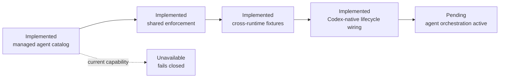

# Codex product adapter

This is the thin product adapter boundary for Codex. Policies, memory and
capability states remain canonical in `bundles/base/runtime/capabilities.json`.

Current state: `bcgos doctor` discovers a local Codex executable, while every
product lifecycle event remains explicitly unavailable. Workspace-local
configuration installs the five bounded command hooks supported by the current
Codex runtime; this does not prove that Codex trusted or invoked them. Native
observation is still pending, and Codex must not inherit Claude-specific
development hooks as a product capability.

The managed Maestro, Case, Client Account, PA Expert, Walter and Darwin definitions live in
`bundles/base/agents/`. `internal/agentorchestration` now provides the shared
fail-closed controller, and the Codex envelope maps
`collaboration_branch_start`, `collaboration_child_start` (legacy denial only), `tool_call_guard`,
`collaboration_child_stop` and `collaboration_branch_stop` to its semantic
events. The shared conformance fixture proves equivalent decisions with
Claude, including forged identities, scopes and unregistered targets. Events
require capability-bound agent identities and exact tool/resource grants. A
shared durable Maestro state store prevents a second adapter instance from
opening a parallel branch and is shared with Claude. Native qualification still
requires fresh session evidence.

Walter review wiring is shared with Claude through `internal/agentdispatch`:
the Codex adapter only forwards a sealed Walter packet and typed verdict to
that core. Walter is Maestro's internal Senior Advisor & Refiner: calm,
precise and constructive, with at most three load-bearing objections. A
blocking refinement must include a concrete fix and acceptance condition;
cosmetic preferences cannot block. Walter has no tools, delegation or direct
user channel. The execution-ledger bridge uses installation-scoped
`maestro/walter-review` custody, distinct from release signing; missing,
stale, replayed or cross-scope custody fails closed. Adapter-command receipts
remain diagnostic until native evidence exists.

The packet also carries a digest-bound IntentReviewPacket: literal prompt,
Maestro route, bounded draft, Owner Context snapshot version/digest and
relevant metadata-only observation references. Walter returns a typed purpose
hypothesis with evidence and confidence; low confidence at high consequence
returns `clarify`. Neither adapter may persist a hypothesis or write Owner
Context; both call the same core.

Maestro resolves two independent decisions: `account_consultation_required`
for client/stakeholder strategic lens, and `walter_required` for high-leverage
output. Account-assisted work proves Account framing → Case → Account
validation; direct Case work proves an execution-only/no-client-lens reason and
does not call Account. Both routes return to Maestro, and only a required
Walter approval—or an explicit low-leverage `walter_skipped` receipt—can reach
the final response.

The lifecycle adapter maps Codex-native command hooks to `session_start`,
`pre_action_guard`, `post_action_observe`, `stop_finalize` and `context_inject`.
Conformance fixtures must remain green before changing a capability state. At
Session Start it also resolves the user-local interaction profile and injects
only its bounded ID and managed policy pointer; the profile must not be derived
from or persisted into memory.

Spec 035 and `docs/lifecycle-readiness.md` record the current evidence matrix:
Codex configuration is not native invocation evidence. Each of the five
bindings remains unavailable until a real native-session observation exists.

Darwin 🧬 is the governance surgeon, not a separate housekeeping agent. The
runtime-neutral `internal/darwin` contract accepts the same bounded packet in
interactive and `headless_housekeeping` modes, applies only the signed
`health/maestro-system` grants and persists metadata-only receipts. Codex
native invocation of that seam remains unavailable until a qualifying native
session observes it.
Darwin maintenance signals use `darwin_maintenance_wake` and map to the same
`darwin` identity over `health/maestro-system`. The signal is signal-only: the
qualified local worker owns command validation, occurrence fencing and receipt
publication. Native scheduler installation remains disabled pending evidence.
