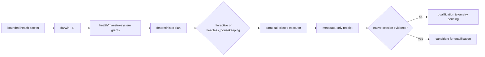

# Darwin 🧬 conformance matrix

This matrix separates the deterministic contract from runtime-native evidence.
Headless housekeeping is a mode of Darwin, not a second agent.



| Implemented contract | Local evidence | Native evidence | State |
| --- | --- | --- | --- |
| Stable identity and emoji | `internal/darwin/contract.go`, catalog and identity tests | Claude/Codex native agent identity receipt | Claude advisory operational beta; Codex pending |
| Registered scoped grant | `internal/agentcatalog`, `internal/agentorchestration/controller_test.go` | Native adapter grant receipt | contract-tested / native unavailable |
| No forged identity or target | shared adapter adversarial fixtures | Native event observation | contract-tested / native unavailable |
| One branch, no Darwin delegation | shared controller and Darwin grant tests | Native lifecycle event sequence | contract-tested / native unavailable |
| Same interactive/headless contract | `internal/darwin/runtime.go`, `contract_test.go`, conformance fixture | Native scheduler wake invoking Darwin | implemented / native unavailable |
| Metadata-only repair receipt | `internal/darwin/store.go`, CLI test | Native session receipt | contract-tested / native unavailable |
| Recoverable failed housekeeping | scheduler `RunDue` contract plus Darwin store receipt | Native scheduler retry evidence | implemented / native unavailable |
| Bounded worker command and lease | `internal/maintenance`, `internal/scheduler/lease.go`, cadence fixture | Native wake invoking worker | contract-tested / native unavailable |
| Deep review proposal ownership | `internal/darwin/proposal_store.go` atomic metadata artifact plus tamper/symlink tests | Native weekly proposal recovery evidence | contract-tested / native unavailable |
| Daily, weekly and monthly cadence | scheduler cadence tests and maintenance catalog | Native scheduler execution | contract-tested / native unavailable |
| Continuous event gate | maintenance command/gate tests; signal-only fixture | Native lifecycle event observation | contract-tested / native unavailable |
| Monthly structural evolution | proposal-only command receipt; no tool invocation | Approved human application record | proposal-only / application unavailable |
| Claude native invocation | managed `.claude/agents/darwin.md` plus start/stop hooks | qualifying Claude session | operational beta; qualification telemetry pending |
| Codex native invocation | adapter docs and lifecycle probe | qualifying Codex session | unavailable: native observation pending |

The attended local Canary is explicit and uses the same `darwin` identity and
`health/maestro-system` scope for health and housekeeping. `bcgos maintenance
canary install-macos --confirm` persists the validated IANA timezone and exact
activated job digests, then reports filesystem and native lifecycle state
separately. Daily Darwin housekeeping and the operational portion of weekly
deep review are contract-tested and locally executable after enrollment: they
may repair only allowlisted, reversible managed state after validation.
Walter and monthly structural work remain due/unavailable. A current-user
macOS install can be
adapter-installed and native-qualified only when `launchctl` confirms it; a
fixture install is filesystem-only. Windows remains
`unavailable_native_qualification_pending`.

Persisted enrollment is a preauthorized local authority and is not serialized
as `Attended=true`; `--attended` remains per-wake consent. A timed-out
non-cooperative handler creates a metadata-only quarantine that survives lease
TTL and appears in maintenance status. It is never silently reclaimed: an
operator must confirm the original process is gone and use the exact
`recover-quarantine` command, which records an audit receipt before clearing
the fence.

No row is promoted by configuration, unit tests or an adapter-command receipt
alone. Native qualification requires an observed session in the target runtime.

## Local invocation

The deterministic CLI exposes the same contract for an operator or a headless
runner:

```sh
bcgos agent darwin assess --stdin
bcgos agent darwin housekeeping --stdin
```

Housekeeping requires three separately supplied capability values through
`BCGOS_MAESTRO_CAPABILITY`, `BCGOS_DARWIN_CAPABILITY` and
`BCGOS_RECOVERY_CAPABILITY`. They authenticate the branch and recovery path;
they are never accepted in the health packet and never appear in a receipt.
