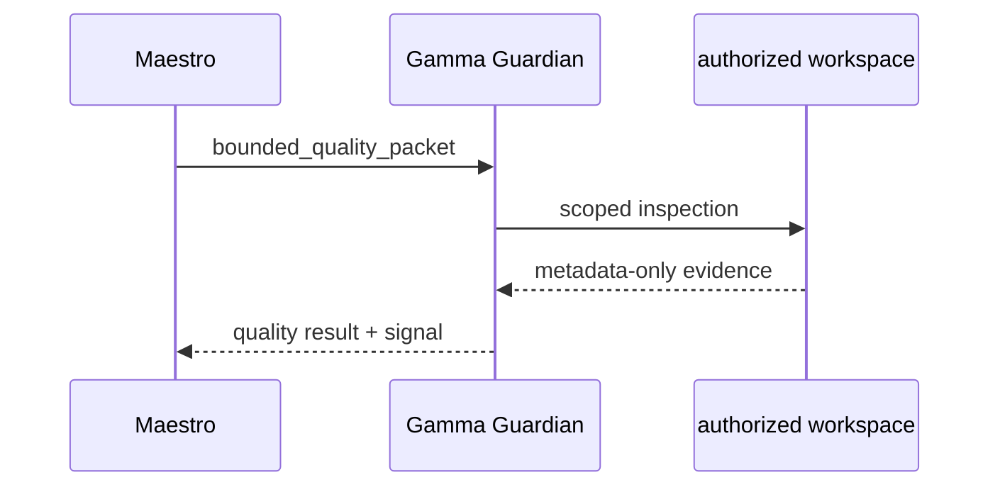

# Gamma Guardian

Gamma Guardian is the longitudinal code-quality agent in Maestro. It is a
direct spoke of Maestro, not a child of the Case Agent. The identity persists
across cases; each quality packet is independently bound to one authorized
workspace and source head.

The runtime grant is bound to the requested workspace only; the evaluator
carries no Case scope or inherited Case context. It covers Clean Code, Architecture/System Design, Testing,
Security/Reliability and Documentation/SDD. It returns `GREEN`, `YELLOW`,
`RED`, `UNAVAILABLE` or `BLOCKED` with bounded scores and evidence IDs.

Gamma is read-only: it cannot edit, merge, publish, create agents, open
parallel branches or change routing. Maestro owns routing and completion. A
local `GREEN` is contract evidence only and does not qualify Claude/Codex or
CI runtime capabilities.

The canonical registration is in
[`bundles/base/agents/catalog.json`](../bundles/base/agents/catalog.json), the
agent definition is in
[`bundles/base/agents/gamma-guardian/AGENT.md`](../bundles/base/agents/gamma-guardian/AGENT.md),
and the conformance fixture is in
[`adapters/conformance/gamma-guardian.json`](../adapters/conformance/gamma-guardian.json).
