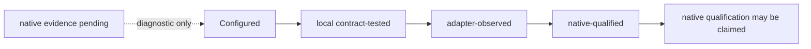

# Lifecycle readiness audit

This is the current evidence boundary for Claude and Codex lifecycle hooks.
It deliberately separates repository configuration, direct contract tests,
adapter-observed receipts and native-session qualification. Evidence labels do
not disable a capability that is already configured and released.

## Evidence snapshot

| Field | Value |
| --- | --- |
| `as_of` | `2026-08-28` |
| `base_commit` | `00617f3af0beab729679ac03e077d3a898b814ab` — `origin/main` comparison point; candidate evidence is working-tree-local, not hosted CI evidence |
| Repository evidence | Configured adapters, local contract fixtures and the non-invasive lifecycle probe are present. |
| Runtime evidence | Bounded in-repo records qualify Claude Code 2.1.203 and Codex CLI 0.149.1 with `gpt-5.6-sol` plus the recorded post-initialization isolated-config digest on macOS arm64 for the same exact unsigned v0.1.13 ZIP digest. Both observed transparent Maestro/host identity; other tuples remain pending. |
| Scheduler evidence | No live `launchctl` observation is attached. Filesystem/plist installation and scheduler loaded/enabled state remain separate claims. |
| Release/pilot evidence | No signed artifact, clean-device acceptance, support/incident owner or pilot-gate record is present in this snapshot. |

`configured` means that wiring is rendered or installed. `local
contract-tested` means repository behavior and fixtures cover the boundary.
`adapter-observed` means a bounded `adapter_command` receipt or equivalent
diagnostic signal proves that the product command/adapter boundary ran; it does
not prove native hook invocation. `native-qualified` requires fresh
supported-runtime observation. The first four are lifecycle evidence classes;
`release-ready` and `pilot-ready` are delivery gates and do not follow from
them.

The diagnostic surface is intentionally explicit about negative evidence:
`adapter-observed` is derived from a validated bounded `adapter_command`
receipt for the requested runtime and workspace, while `attested_capture_files`
counts only HMAC-attested memory capture files. A SessionStart payload or a
managed `CLAUDE.md` can prove configuration and context projection, but it is
not a memory capture and cannot be promoted to adapter or native evidence.

## Current matrix

| Event | Claude | Codex | Native promotion blocker |
| --- | --- | --- | --- |
| `session_start` | native-qualified for recorded macOS tuple | native-qualified jointly with `context_inject` for recorded macOS tuple | Bounded Codex report does not attribute injected bytes to one member of the context-hook pair |
| `context_inject` | native-qualified for recorded macOS tuple | native-qualified jointly with `session_start` for recorded macOS tuple | Bounded Codex report does not attribute injected bytes to one member of the context-hook pair |
| `pre_action_guard` | native-qualified for recorded macOS tuple | native-qualified for recorded macOS tuple; destructive Git denial observed | Fresh observation for other tuples |
| `post_action_observe` | native-qualified for recorded macOS tuple; async receipt observed | native-qualified for recorded macOS tuple; receipt observed | Fresh observation for other tuples |
| `stop_finalize` | native-qualified for recorded macOS tuple; synchronous completion receipt observed | native-qualified for recorded macOS tuple; receipt observed | Fresh observation for other tuples |

The canonical manifest keeps native qualification as a separate evidence field.
Configured lifecycle behavior remains enabled; the local probe reports the
evidence boundary without starting a model session, writing a receipt or
changing runtime configuration.

## Readiness status

| Readiness class | Snapshot status |
| --- | --- |
| Configured | Yes — workspace-local Claude and Codex adapters are represented; Claude additionally projects five managed native agents. |
| Local contract-tested | Repository fixtures and deterministic boundaries are present; `go run ./dev/harness validate --full` passed on candidate branch `012c08f` (branch-local evidence, not hosted CI). |
| Adapter-observed | Yes for the recorded Claude and Codex tuples — bounded metadata-only lifecycle receipts accompany the native observations. |
| Native-qualified | Yes only for the exact Claude Code 2.1.203 tuple and the Codex CLI 0.149.1 / `gpt-5.6-sol` / post-initialization isolated-config digest / macOS arm64 / v0.1.13 artifact tuple in their bounded records. |
| Release-ready | No — signing, publication and release-gate evidence are absent. |
| Pilot-ready | No — clean-device, support/incident ownership and pilot-gate evidence are absent. |

## Audit findings

- Claude's exact managed projection enables the controlled beta. The lifecycle
  probe still applies a qualification floor, but missing qualification evidence
  does not disable the released path.
- Codex's adapter configures all five command-hook events. The recorded native
  matrix observed the context pair, guard and PostToolUse/Stop receipts. It
  bypassed only interactive trust review for the exact inspected synthetic
  hooks; ordinary use still requires `/hooks` review.
- `adapter_command` receipts remain diagnostic only. They do not become native
  evidence and cannot change the manifest.
- `.codex/RUNTIME-CONTRACT.md` and `.codex/CODEX-RUNTIME.md` are not present in
  the snapshot commit; their absence is recorded as a documentation gap rather
  than replaced by an invented runtime contract.
- PA Expert stubs are unrelated consultative components and are not lifecycle
  dependencies.

## Next qualifying evidence

1. Add per-event attribution for the Codex SessionStart/UserPromptSubmit pair
   if a future native stream exposes that distinction without retaining prompt
   content.
2. Repeat both matrices for each additional runtime/platform/artifact tuple
   before extending the claim beyond the recorded macOS slice.
3. Set aggregate `native_qualified=true` only when its scope is backed by a reviewed record with
   runtime/platform identity and bounded event evidence.

Claude and Codex are natively qualified only for their recorded tuples and are
not production release-ready.

Yoda has a separate native qualification recipe in
[`docs/yoda-native-qualification.md`](yoda-native-qualification.md). It
must be completed before claiming qualified Yoda evidence. It does not gate
the controlled-beta Yoda path.

## Darwin cadence status

Darwin's runtime-neutral worker contract now has explicit command deadlines,
locally qualified catalog/attendance test paths, exact occurrence binding,
non-blocking occurrence-keyed fenced execution, immutable attempt receipts with
occurrence-level idempotency, continuous/event gatekeeping and
daily/weekly/monthly cadence fixtures. Busy is an ephemeral nonterminal result,
and the shipped catalog-only/unavailable catalog cannot authorize execution.
These are local contract evidence only. The native Darwin advisory projection
is operational in the Claude beta, while scheduler-backed housekeeping remains
a separate capability. A live macOS scheduler observation would be a separate
scheduler gate, not lifecycle native qualification.
