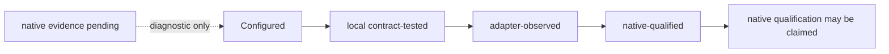

# Lifecycle readiness audit

This is the current evidence boundary for Claude and Codex lifecycle hooks.
It deliberately separates repository configuration, direct contract tests,
adapter-observed receipts and native-session qualification. Evidence labels do
not disable a capability that is already configured and released.

## Evidence snapshot

| Field | Value |
| --- | --- |
| `as_of` | `2026-08-10` |
| `base_commit` | `43e86494b2e32ca8eccece843514b75d2c98ffa7` — `origin/main` comparison point at review start; candidate evidence was run on `012c08f` and is not hosted CI evidence |
| Repository evidence | Configured adapters, local contract fixtures and the non-invasive lifecycle probe are present; no model session was started for this documentation update. |
| Runtime evidence | No reproducible in-repo runtime-version artifact or fresh native-session observation is attached for either runtime; prior external version observations are not treated as current snapshot evidence. |
| Scheduler evidence | No live `launchctl` observation is attached. Filesystem/plist installation and scheduler loaded/enabled state remain separate claims. |
| Release/pilot evidence | No signed artifact, clean-device acceptance, support/incident owner or pilot-gate record is present in this snapshot. |

`configured` means that wiring is rendered or installed. `local
contract-tested` means repository behavior and fixtures cover the boundary.
`adapter-observed` means a bounded `adapter_command` receipt or equivalent
diagnostic signal proves that the product command/adapter boundary ran; it does
not prove native hook invocation. `native-qualified` requires fresh
supported-runtime observation. The first four are lifecycle evidence classes;
`release-ready` and `pilot-ready` are delivery gates and do not follow from
them.

The diagnostic surface is intentionally explicit about negative evidence:
`adapter-observed` is derived from a validated bounded `adapter_command`
receipt for the requested runtime and workspace, while `attested_capture_files`
counts only HMAC-attested memory capture files. A SessionStart payload or a
managed `CLAUDE.md` can prove configuration and context projection, but it is
not a memory capture and cannot be promoted to adapter or native evidence.

## Current matrix

| Event | Claude | Codex | Native promotion blocker |
| --- | --- | --- | --- |
| `session_start` | operational beta; native-qualified: no | configured + local contract-tested; native-qualified: no | Qualification telemetry only; not a Claude availability gate |
| `context_inject` | operational beta; native-qualified: no | configured + local contract-tested; native-qualified: no | Qualification telemetry only; not a Claude availability gate |
| `pre_action_guard` | operational beta; native-qualified: no | configured + local contract-tested; native-qualified: no | Qualification telemetry only; not a Claude availability gate |
| `post_action_observe` | operational beta, async; native-qualified: no | configured + local contract-tested; native-qualified: no | Qualification telemetry only; not a Claude availability gate |
| `stop_finalize` | operational beta, synchronous completion gate + local contract-tested; native qualification remains telemetry | configured + local contract-tested; adapter-observed: not captured; native-qualified: no | Beta telemetry for Claude; fresh qualifying observation for Codex |

The canonical manifest keeps native qualification as a separate evidence field.
Configured lifecycle behavior remains enabled; the local probe reports the
evidence boundary without starting a model session, writing a receipt or
changing runtime configuration.

## Readiness status

| Readiness class | Snapshot status |
| --- | --- |
| Configured | Yes — workspace-local Claude adapter and five managed subagents are represented. |
| Local contract-tested | Repository fixtures and deterministic boundaries are present; `go run ./dev/harness validate --full` passed on candidate branch `012c08f` (branch-local evidence, not hosted CI). |
| Adapter-observed | No — no bounded `adapter_command` receipt or equivalent diagnostic signal is attached in this snapshot. |
| Native-qualified | No — telemetry remains pending; Claude availability is nevertheless operational in the controlled beta. |
| Release-ready | No — signing, publication and release-gate evidence are absent. |
| Pilot-ready | No — clean-device, support/incident ownership and pilot-gate evidence are absent. |

## Audit findings

- Claude's exact managed projection enables the controlled beta. The lifecycle
  probe still applies a qualification floor, but missing qualification evidence
  does not disable the released path.
- Codex's adapter configures all five command-hook events, but no
  adapter-observed receipt or native-session observation is attached; none is
  promoted without fresh native-session evidence.
- `adapter_command` receipts remain diagnostic only. They do not become native
  evidence and cannot change the manifest.
- `.codex/RUNTIME-CONTRACT.md` and `.codex/CODEX-RUNTIME.md` are not present in
  the snapshot commit; their absence is recorded as a documentation gap rather
  than replaced by an invented runtime contract.
- PA Expert stubs are unrelated consultative components and are not lifecycle
  dependencies.

## Next qualifying evidence

1. Use a supported Claude runtime that satisfies the current lifecycle floor,
   install the exact workspace-local bindings, and capture a fresh native
   observation for all five events.
2. Capture native Codex observations for all five configured events, including
   trust review for the workspace-local hook definitions.
3. Set `native_qualified=true` only from a reviewed record with
   runtime/platform identity and bounded event evidence.

Until then, Claude is operational for Canary validation but not natively
qualified or production release-ready; Codex remains outside this activation.

Yoda has a separate native qualification recipe in
[`docs/yoda-native-qualification.md`](yoda-native-qualification.md). It
must be completed before claiming qualified Yoda evidence. It does not gate
the controlled-beta Yoda path.

## Darwin cadence status

Darwin's runtime-neutral worker contract now has explicit command deadlines,
locally qualified catalog/attendance test paths, exact occurrence binding,
non-blocking occurrence-keyed fenced execution, immutable attempt receipts with
occurrence-level idempotency, continuous/event gatekeeping and
daily/weekly/monthly cadence fixtures. Busy is an ephemeral nonterminal result,
and the shipped catalog-only/unavailable catalog cannot authorize execution.
These are local contract evidence only. The native Darwin advisory projection
is operational in the Claude beta, while scheduler-backed housekeeping remains
a separate capability. A live macOS scheduler observation would be a separate
scheduler gate, not lifecycle native qualification.
