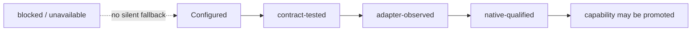

# Lifecycle readiness audit

This is the current evidence boundary for Claude and Codex lifecycle hooks.
It deliberately separates repository configuration, direct contract tests,
adapter-command receipts and native-session qualification. No row below
promotes a capability by implication.

## Current matrix

| Event | Claude 2.1.119 | Codex 0.144.1 | Native promotion blocker |
| --- | --- | --- | --- |
| `session_start` | configured + contract-tested; native observation blocked by version | configured + contract-tested; native observation not captured | Fresh native-session observation from a qualifying runtime |
| `context_inject` | configured + contract-tested; native observation blocked by version | configured + contract-tested; native observation not captured | Claude version; fresh Codex native observation |
| `pre_action_guard` | configured + contract-tested; native observation blocked by version | configured + contract-tested; native observation not captured | Claude version; fresh Codex native observation |
| `post_action_observe` | configured async + contract-tested; native observation blocked by version | configured + contract-tested; native observation not captured | Claude version; fresh Codex native observation |
| `stop_finalize` | configured async + contract-tested; native observation blocked by version | configured + contract-tested; native observation not captured | Claude version; fresh Codex native observation |

The canonical manifest remains `unavailable` for every lifecycle capability.
The local probe reports the same matrix without starting a model session,
writing a receipt or changing runtime configuration.

## Audit findings

- Claude is detected at `2.1.119`; the lifecycle contract requires `2.1.177`.
  No Claude native trial is eligible until the runtime is upgraded.
- Codex is detected at `0.144.1`; its stable hooks feature exposes the five
  command-hook events. The adapter configures all five, but none is promoted
  without fresh native-session observation.
- `adapter_command` receipts remain diagnostic only. They do not become native
  evidence and cannot change the manifest.
- `.codex/RUNTIME-CONTRACT.md` and `.codex/CODEX-RUNTIME.md` are not present in
  the current `main`; their absence is recorded as a documentation gap rather
  than replaced by an invented runtime contract.
- PA Expert stubs are unrelated consultative components and are not lifecycle
  dependencies.

## Next qualifying evidence

1. Upgrade Claude to at least `2.1.177`, install the exact workspace-local
   bindings, and capture a fresh native observation for all five events.
2. Capture native Codex observations for all five configured events, including
   trust review for the workspace-local hook definitions.
3. Promote a capability only from a reviewed `native-qualified` record with
   runtime/platform identity and bounded event evidence.

Until then, readiness remains contract-validated only; neither runtime is
pilot-ready for lifecycle activation.
