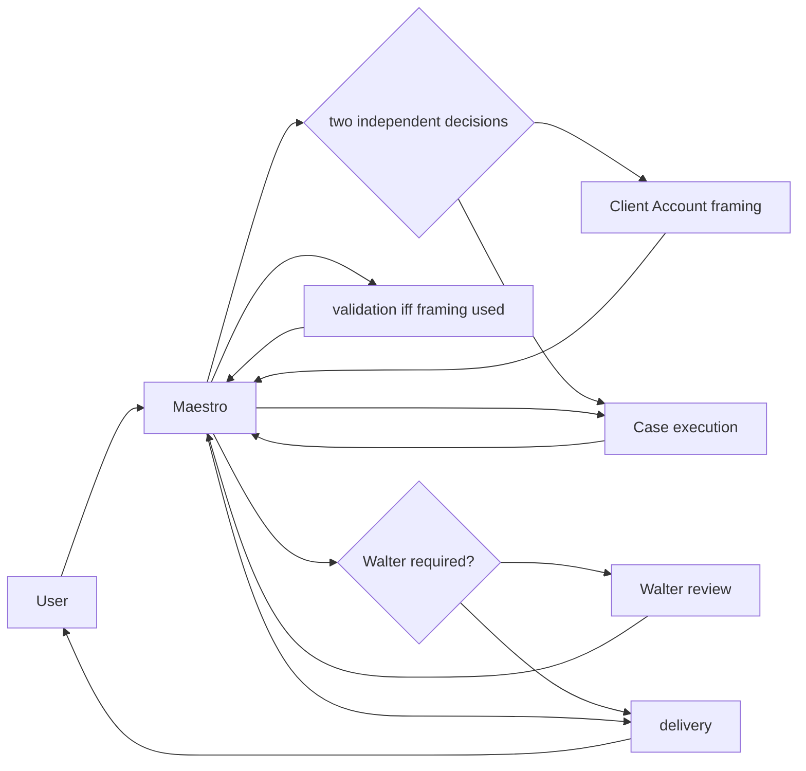

# Maestro agent governance

Maestro is the sole user-facing hub. It keeps one active spoke globally and
mediates every packet; agents never call one another or open nested work.

The first decision is `account_assistance`: account-assisted work has both
framing and return validation; direct Case work has neither. The second is
`walter_required`: material or ambiguous work goes to Walter, while a
low-materiality skip requires a Maestro reason code and evidence. The two
decisions are never collapsed into one depth profile.

Case methods remain local skills. PA Expert is the sole centrally versioned
FPA/IPA advisory authority. Walter is internal and tool-free. Darwin handles
scoped health/governance maintenance only and cannot approve itself or mutate
live policy.
