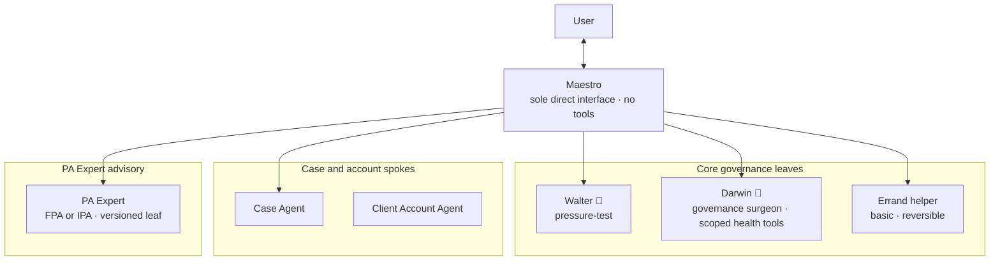
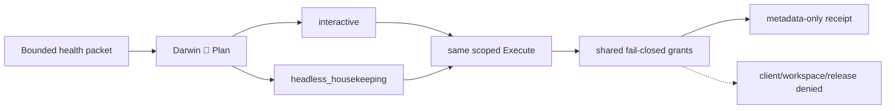
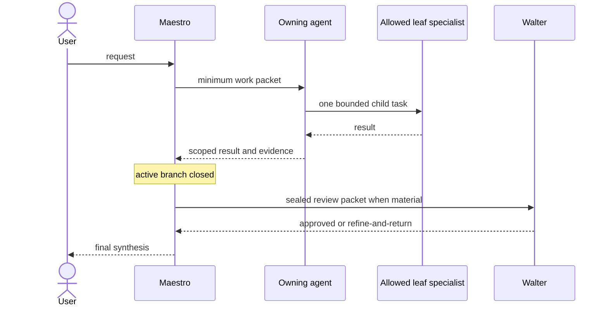
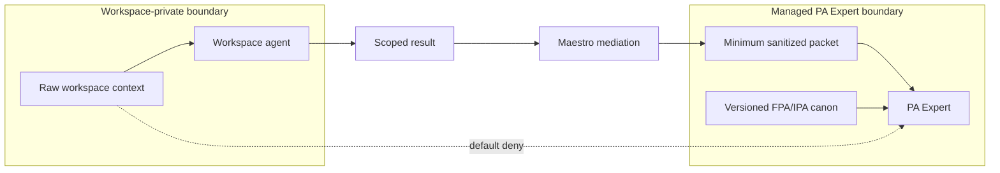
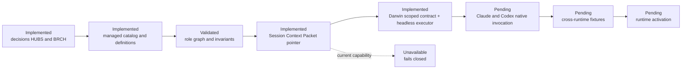

# Maestro agent governance - visual guide

This guide shows the agent-orchestration foundation implemented in the managed
bundle and development harness. The catalog, definitions, validation and
Session Context Packet pointer exist today. Native Claude and Codex activation
does not: `agent_orchestration` remains fail-closed and `unavailable`.

## What was implemented

The user has one conversational surface. Maestro can select one governed branch
at a time, but has no filesystem, shell, web, messaging or external-system
tools. Darwin 🧬 is the one governance exception: a non-user-facing surgeon
with signed, reversible maintenance grants limited to `health/maestro-system`.
The catalog allows only Maestro-mediated sequential direct spokes; nesting is
denied.

The graph is a registration policy, not permission to run all branches. The
runtime contract remains one active direct spoke, with no nesting or direct
agent-to-agent calls.

Headless housekeeping is not a new agent or a parallel taxonomy. The scheduler
invokes the same Darwin contract with `mode=headless_housekeeping`, the same
identity and grants, and the same metadata-only receipt path used by an
interactive health episode.

## How sequential delegation works

A second chain starts only after the first one returns to Maestro. Walter may
review a material recommendation after specialist work because the specialist
branch is already closed.

## How workspace and PA Expert knowledge stay separate

Workspace agents can receive authorized workspace context. PA Experts use a
versioned FPA/IPA canon and cannot read raw workspace context. If both chains
contribute, Maestro mediates a minimum sanitized packet; the agents never
browse or message each other.

## What is live and what remains gated

The current implementation stops at runtime-neutral definitions and bounded
discovery. Runtime activation requires native adapter enforcement plus shared
conformance evidence.

## Evidence map

| Concern | Canonical evidence |
| --- | --- |
| Product and architecture decisions | `docs/decisions/decision-log.md` (`HUBS`, superseded by `BRCH`) |
| Role graph and limits | `bundles/base/agents/catalog.json` |
| Core definitions | `bundles/base/agents/maestro/AGENT.md`, `walter/AGENT.md`, `darwin/AGENT.md` |
| Deterministic validation | `internal/agentcatalog/`, `internal/dev/mermaiddoc/`, `dev/harness` |
| Darwin contract and receipts | `internal/darwin/`, `specs/018-maestro-core-agents.md`, `specs/032-canary-observability.md` |
| Session discovery | `specs/015-session-context-packet.md`, `internal/sessionctx/` |
| Runtime activation boundary | `specs/004-runtime-portability.md`, `adapters/claude/`, `adapters/codex/` |
| Reusable visual workflow | `dev/skills/visualize-change/` |

The canonical architecture contract remains
[`specs/018-maestro-core-agents.md`](../../specs/018-maestro-core-agents.md).
