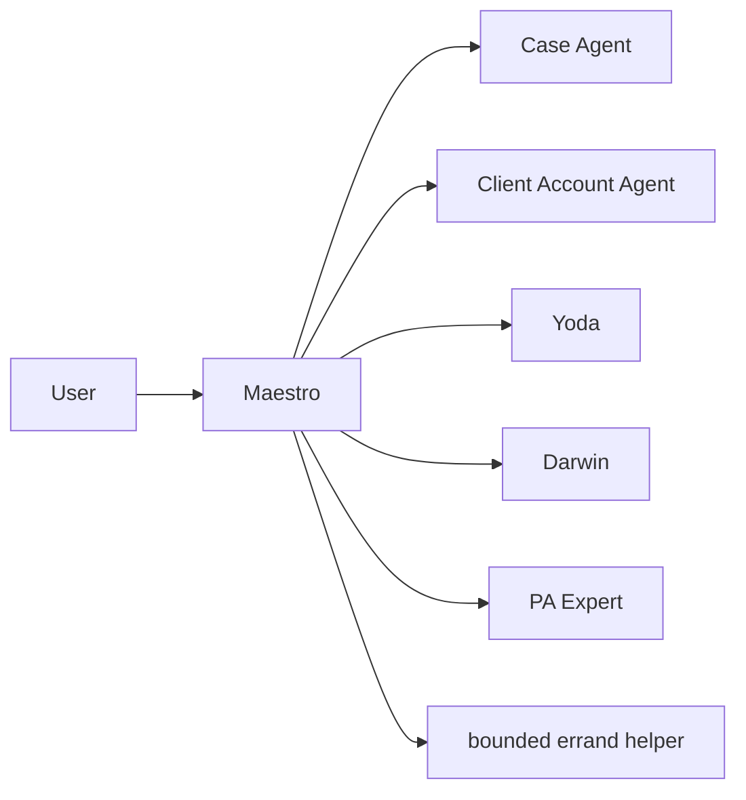

# Spec 016 — Case Agent boundaries

The Case Agent is a bounded execution leaf. Maestro is the only user-facing
hub and the only component allowed to open a direct spoke.

Case execution may use only its exact scope and granted tools. It cannot open
another agent, call Client Account or Yoda directly, or communicate with the
user. A Case result returns to Maestro, which decides the next mediated packet.

The catalog enforces one active spoke globally, depth one, zero children per
agent and a bounded sequential quality loop. A simple reversible Case may use
the direct-case path, which skips only the Client Account pre-brief. An
account-assisted Case uses Client Account framing before execution and then
Client Account validation after the Case returns. Each path then follows the
independent materiality decision: Yoda is invoked for material output and a
typed low-materiality skip may deliver directly through Maestro.

Caller-provided role strings, skill names and prompts never grant authority.
The runtime binds the exact agent ID, immutable scope, authorization digest,
capability digest and state snapshot to every packet.
