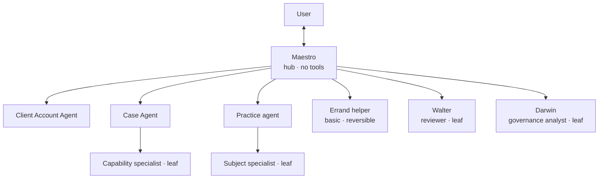
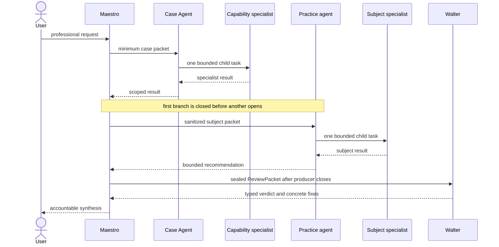
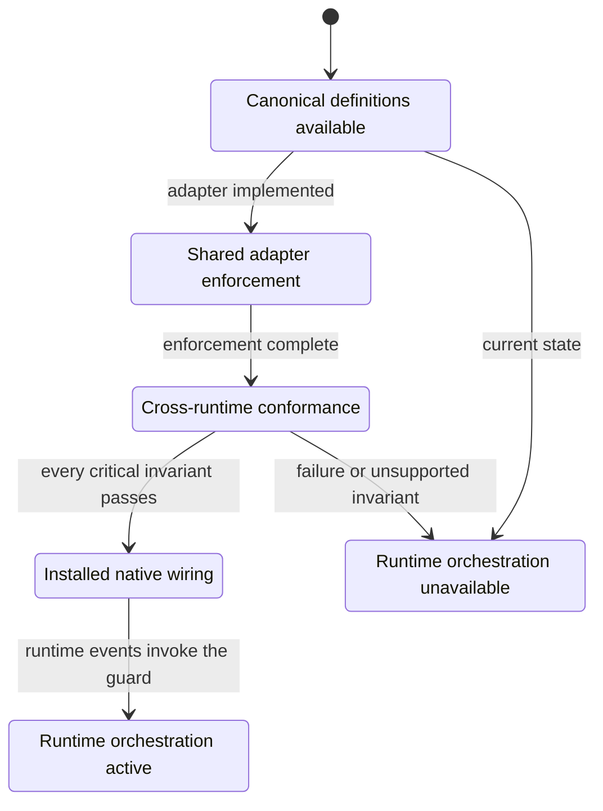

# Spec 018 - Maestro core agents

Status: accepted architecture; canonical catalog, bounded Session Context
Packet pointer, shared fail-closed enforcement and cross-runtime conformance
fixtures implemented. Native Claude and Codex activation remains unavailable
until their installed event wiring invokes the enforcement core.

## Objective

Give Maestro a small professional orchestration core without copying the
personal domains, broad tool surface, background hooks or deep agent tree of
Kowalski OS.

## Topology

Maestro is the only direct user interface. Multiple governed chain types may be
registered, but only one branch is active by default. Delegation is sequential,
each agent may have at most one active child and maximum depth is two. A
workflow may complete one chain and then call Walter; it may not keep both
branches active concurrently.

Material output has one deterministic review seam: after the producing root is
completed, Maestro seals a bounded `ReviewPacket` with the source packet ID and
digest, trigger, audience, recommendation, definition of done, pointers and
uncertainties, then opens Walter as a direct leaf. Walter returns a typed
`approved`, `refine-and-return` or `missing-the-mark` verdict. The receipt keeps
only the source digest, trigger, verdict state and objection count; review prose
and packet bodies remain ephemeral. A generic return cannot close a Walter
packet, and a review verdict cannot grant execution-ledger completion authority.

The adapter-owned delegation channel is control-plane orchestration, not
general tool access. Maestro may select and dispatch an allowed direct spoke
through that channel while remaining unable to call filesystem, shell, web,
messaging or external-system tools. A spoke may dispatch one child only when
the catalog explicitly allows its role edge at depth two.

Basic reversible errands may use at most one bounded helper. An errand helper
does not receive broad workspace access, persistent memory or permission to
delegate. Substantive project work remains with the owning workspace agent.

## Core roles

### Maestro

- receives the bounded Session Context Packet and the user's request;
- resolves the active workspace before substantive work;
- chooses one smallest useful governed chain and supplies a minimum work packet;
- has no filesystem, shell, web, messaging or external-system tools;
- synthesizes returned work and remains accountable for the answer;
- routes material recommendations and external-facing output through Walter;
- may request Darwin only for system health, drift or operating-model questions.

### Walter

- is an internal pressure-test, not a second general assistant;
- receives a sealed review packet prepared by Maestro;
- reconstructs the judgment independently instead of echoing Maestro's rationale;
- returns `approved`, `refine-and-return` or `missing-the-mark`;
- surfaces at most three load-bearing objections, each with a concrete fix;
- has no tools, delegation or direct user channel;
- does not own execution or replace the user's judgment.

`refine-and-return` and `missing-the-mark` return control to Maestro and do not
satisfy completion. Only a qualified adapter may translate an independently
supported `approved` verdict into the separate binary, authenticated review
decision used by the execution ledger. The conversational verdict must never
grant authority or become an indefinite veto loop: each objection names an
owner, a concrete fix and an exit condition.

### Darwin

- evaluates system health, drift, coverage gaps and avoidable operating friction;
- receives a bounded health packet produced by deterministic product surfaces;
- proposes at most three prioritized changes with evidence and trade-offs;
- diagnoses and executes only reversible repairs inside the signed
  `health/maestro-system` scope;
- has scoped tools, no delegation and no direct user channel;
- interactive and `headless_housekeeping` are modes of the same Darwin
  identity, executor and metadata-only receipt contract;
- returns proposals to Maestro; material proposals pass through Walter.

## Governed chain roles

- A `case_agent` may delegate to one `capability_specialist` at depth two.
- A `client_account_agent` owns the partner-like account context and does not
  directly delegate children; Maestro mediates Case activation.
- A `practice_agent` may delegate to one `subject_specialist` at depth two.
- Walter (`reviewer`), Darwin (`governance_analyst`), `errand_helper`,
  `capability_specialist` and `subject_specialist` are leaves.
- A practice agent owns a persistent professional subject canon. It cannot read
  raw workspace context or use workspace authorization.
- Cross-chain exchange returns to Maestro as a minimum sanitized packet. Agents
  do not browse or message another chain directly.

Practice agents are governed extensions, not empty generic personas. A concrete
practice agent is registered only when it has an accountable owner, bounded
canon and named professional mandate.

## Canonical catalog

`bundles/base/agents/catalog.json` is the runtime-neutral source of truth for
the hub identity, registered-chain policy, allowed role edges, delegation
limits, role metadata, tool policy and definition pointers. Agent prompt files
are managed content and may not contain user, client or workspace data.

The catalog uses a closed role set. Each role has one exact input and tool
contract so a new registration cannot silently broaden context:

| Role | Input contract | Tools | May delegate |
| --- | --- | --- | --- |
| `hub` | `session_context_packet` | none | yes |
| `client_account_agent` | `bounded_client_account_packet` | scoped | no |
| `case_agent` | `bounded_case_packet` | scoped | yes |
| `practice_agent` | `bounded_practice_packet` | scoped | yes |
| `reviewer` | `sealed_review_packet` | none | no |
| `governance_analyst` | `bounded_health_packet` | scoped (`health/maestro-system`) | no |
| `errand_helper` | `bounded_errand_packet` | scoped | no |
| `capability_specialist` | `minimum_work_packet` | scoped | no |
| `subject_specialist` | `bounded_subject_packet` | scoped | no |

Agent IDs are path-safe lowercase slugs. Definitions must resolve below the
managed `bundles/base/agents/` root.

The canonical catalog contains managed always-present agents. Generic,
data-free workspace and leaf-specialist templates plus their user-local,
scope-bound instance manifests are governed by
`specs/027-agent-scaffolding.md`. A local stub does not alter the managed
catalog or imply native runtime activation.

The Session Context Packet exposes only the catalog pointer, hub ID and
activation state. It never copies prompt bodies into the packet.

## Runtime activation gate

Canonical definitions and the shared enforcement controller being available
are not equivalent to agents being enabled in Claude or Codex. The thin adapter
envelopes map runtime-specific events to one semantic controller and the shared
fixture proves equivalent decisions. A runtime may report orchestration
available only after its installed event wiring invokes that controller and the
fixtures prove:

1. Maestro cannot call tools directly;
2. only one branch can be active at a time;
3. each agent can have at most one active child;
4. delegation cannot exceed depth two or leave the allowed role graph;
5. Walter, Darwin, errands and leaf specialists cannot delegate;
6. workspace scopes remain default-deny and practice agents cannot read raw
   workspace context;
7. authenticated agent IDs, scope and resource grants cannot be forged;
8. one shared state snapshot survives adapter replacement and has bounded,
   capability-gated stale recovery; and
9. an unsupported critical invariant fails closed rather than degrading.

`internal/agentorchestration` implements the stateful guard. Claude and Codex
use distinct adapter event names, while
`adapters/conformance/agent-orchestration.json` provides the shared sequence.
Each event is authenticated against an immutable agent authorization: agent
ID, closed catalog role, branch scope, canonical scope kind, capability digest
and exact tool, operation and resource-prefix grants. Caller-supplied roles do
not authorize work. Root roles bind scope kinds (`workspace`, `account`,
`practice`, `review`, `health` or `errand`); a child must inherit the same
scope root and kind. A practice chain therefore cannot receive a workspace
resource grant. `bcgos://public/` is the only explicit cross-scope exception.
Unregistered agents, forged capabilities, cross-scope resources, unknown
runtimes and unknown events fail closed. BCGOS resource URIs are parsed and
canonicalized before comparison; encoded or path traversal is rejected.

Claude and Codex adapters must share one state store per installation. Its
snapshot preserves the active root, child and last update across adapter
replacement or process restart, and carries a deterministic fingerprint of the
complete authorization policy. A replacement adapter with different roles,
scopes, capabilities or grants is rejected. A lost stop event remains blocked
until an explicit age-bounded recovery presents the store recovery capability.
Native wiring owns durable snapshot persistence and atomic restoration; until
that is installed and proven, the Session Context Packet reports definitions
`available` and runtime activation `unavailable` with a reason.

## Acceptance criteria

1. The canonical catalog identifies Maestro as the sole direct hub.
2. The catalog rejects tool access for Maestro and Walter, and rejects any
   Darwin grant outside the bounded `health/maestro-system` scope.
3. The catalog permits workspace-to-capability and practice-to-subject chains
   at depth two.
4. The catalog rejects parallel branches, multiple children, unauthorized role
   edges, depth above two or more than one errand helper.
5. Walter points to a managed packet-only definition; Darwin points to a
   managed packet-and-receipt definition with scoped maintenance authority.
6. The Session Context Packet exposes the catalog pointer without prompt bodies.
7. Claude and Codex adapter envelopes pass the same conformance fixture and
   remain explicitly unavailable until native event wiring invokes the guard.
8. Registered identity, capability, workspace scope and exact resource grants
   are checked before delegation or tool use.
9. Shared state rejects parallel controllers, can be restored after restart and
   requires explicit capability-gated recovery after a stale branch.
