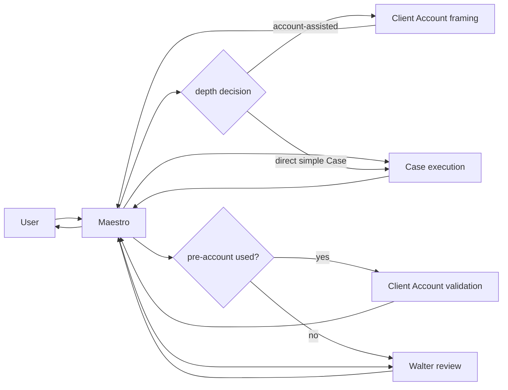

# Spec 018 — Maestro core agents

Maestro is the sole user-facing hub. It owns planning, packet mediation,
scope binding, receipts and delivery. Maestro has no tools and does not grant
authority from caller text.

The managed core is:

| Agent | Role | User channel | Tools | Delegates |
| --- | --- | --- | --- | --- |
| Maestro | `hub` | yes | none | direct spokes only |
| Case Agent | `case_agent` | no | scoped | no |
| Client Account Agent | `client_account_agent` | no | scoped | no |
| PA Expert | `pa_expert` | no | none | no |
| Walter | `reviewer` | no | none | no |
| Darwin | `governance_analyst` | no | scoped maintenance | no |

Walter is an internal, tool-free review leaf. Darwin is a scoped health and
governance leaf; it cannot execute client work, approve its own changes or
mutate live policy. PA Expert is the sole FPA/IPA practice authority and is
centrally versioned; its registry may be empty.

## Deterministic Case topology

`post_account_validation_required == pre_account_used` is a typed planner
invariant. Account-assisted plans must include both framing and validation;
direct-case plans include neither and have an auditable pre-brief skip reason.
`walter_invocation == resolved_walter_required` is a separate planner
invariant. Low-materiality plans carry an explicit Walter-skip reason and
evidence; materiality uncertainty resolves to Walter.

Every content mutation clears downstream approvals and re-enters Case through
Maestro. Account and Walter cycles and Case attempts have deterministic
budgets; exhaustion fails closed with a receipt.

No agent-to-agent call, nesting or second active branch is valid. The native
runtime may expose legacy event names only to return a deterministic denial.

For high-leverage Walter review, Maestro seals an `IntentReviewPacket` with
the prompt, route, draft, bounded context, audience, consequence,
reversibility, self projection version/digest and relevant observation
metadata. Walter returns a typed intrinsic-intent hypothesis and constructive
advice with confidence; this is proxy review, not impersonation or a second
self authority. Walter is read-only/tool-less and never writes the canonical
Owner Context. Every loop is evaluated for a possible owner signal, but only
material authenticated owner speech/action may be appended locally.
