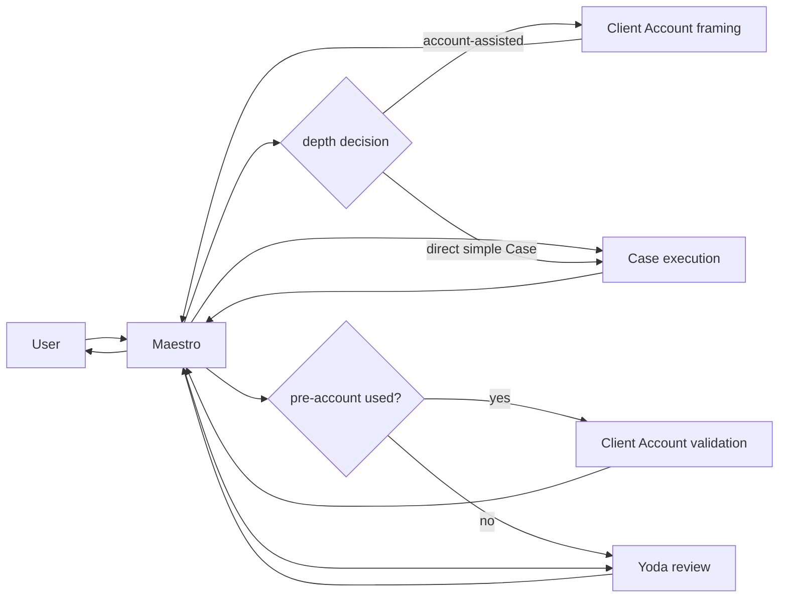

# Spec 018 — Maestro core agents

Maestro is the primary user-facing hub. It owns accountability for planning,
coordination and delivery. It can use runtime-native delegation when available;
authority is bounded by the active workspace, the user's request and the host
runtime rather than by a pre-enumerated route.

The managed core is:

| Agent | Role | User channel | Tools | Delegates |
| --- | --- | --- | --- | --- |
| Maestro | `hub` | yes | none | registered agents |
| Case Agent | `case_agent` | no | scoped | scoped consultation |
| Client Account Agent | `client_account_agent` | no | scoped | scoped consultation |
| PA Expert | `pa_expert` | no | none | no |
| Yoda | `reviewer` | no | none | no |
| Darwin | `governance_analyst` | no | scoped maintenance | no |
| Gamma Guardian | `quality_guardian` | no | scoped inspection | no |

Yoda is an internal, tool-free review leaf. Darwin is a scoped health and
governance leaf; it cannot execute client work, approve its own changes or
mutate live policy. PA Expert is the sole FPA/IPA practice authority and is
centrally versioned; its registry may be empty.

Gamma Guardian is a longitudinal quality spoke owned by Maestro, not a child of
the Case Agent. It evaluates one authorized workspace per bounded packet and
does not inherit Case context. Its rubric is transversal, but its managed agent
identity remains a direct spoke with no children.

## Recommended Case topology

When Client Account framing is used, post-Case validation by the same account
agent is the recommended default. Maestro may adapt the route when another
composition better serves the task. Yoda is selected independently by
leverage, consequence and the value of a user-proxy refinement.

Budgets, receipts and route events are observability aids. They should advise
the model, support recovery and make behavior inspectable, but do not block
safe attended work merely because evidence is missing. Agents may call other
registered agents with attenuated scope and must return a concise result to the
accountable owner.

For high-leverage Yoda review, Maestro seals an `IntentReviewPacket` with
the prompt, route, draft, bounded context, audience, consequence,
reversibility, self projection version/digest and relevant observation
metadata. Yoda returns a typed intrinsic-intent hypothesis and constructive
advice with confidence; this is proxy review, not impersonation or a second
self authority. Yoda is read-only/tool-less and never writes the canonical
Owner Context. Every loop is evaluated for a possible owner signal, but only
material owner-attested speech/action may be appended locally.
