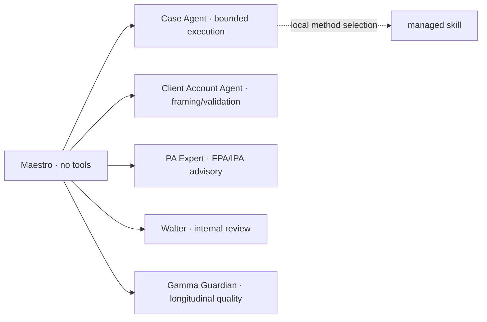

# Spec 034 — Case methods and practice advice

Skills are methods selected locally by the active Case Agent. They are not
agents, authority grants or delegation edges.

The planner signs the exact Case scope, capability digest, skill policy and
state snapshot. A skill cannot create a packet, select another role, widen
scope or grant tools. Client Account, Walter and PA Expert are reached only by
Maestro-mediated packets. Gamma Guardian is also Maestro-mediated, but is a
longitudinal quality agent rather than a Case child; its quality rubric is a
transversal method inside that agent, not a replacement for the agent identity.

Case topology is depth one with one active spoke. Account-assisted work uses
Client Account framing, Case execution and Client Account validation. A
trivial direct Case skips only framing; its result goes back to Maestro,
which independently resolves whether Walter is needed. A low-materiality
result may use only the typed Walter skip. Content mutation clears approvals
and starts a bounded new Case attempt.

The PA Expert registry is the only practice-advisory authority. FPA/IPA
canon is versioned and digest-bound; an empty registry fails advisory routing
closed rather than inventing an expert.
