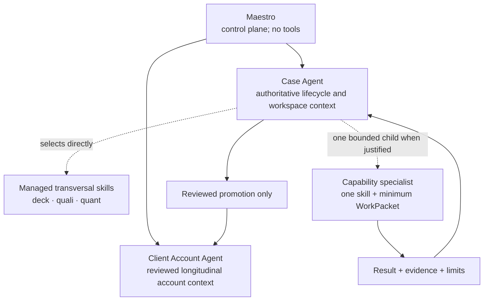

# Spec 034 - Vertical agents and transversal skills

Status: accepted architecture; direct-skill selection and a bounded delegated
skill wire are implemented in the runtime-neutral core. Native Claude and
Codex activation remains unavailable until their adapters deliver the same
verified contract.

## Objective

Preserve the context and accountability of a professional case while making
methods such as deck construction, qualitative analysis, quantitative analysis,
onboarding and logging reusable across cases and client accounts.

## Core distinction

An **agent** owns a bounded context, authorization scope, lifecycle, task and
Definition of Done. A **skill** is a managed, transversal and atomic method.
It supplies procedure, not authority. A skill never grants a tool, expands a
resource scope, creates persistent memory, addresses the user or delegates.

The current role graph maps this distinction as follows:

Client Account Agent, Case Agent and PA expert are the authoritative lifecycle
roles. The former `workspace_agent` and `account_agent` names are input-only
compatibility aliases; new registrations and the delegation graph use only the
canonical roles. Existing technical workspace IDs remain recognizable during
migration, but manifests created before the identity/signature schema must be
explicitly re-scaffolded; legacy role names are never emitted as new role
nodes.

## Selection and delegation

The Case Agent receives the intent, authorized pointers, constraints
and Definition of Done. It may select one or more compatible skills directly
without opening a child delegation. Direct selection is local to a current
signed root packet, authenticated by the root agent capability, and is denied
while a child is active. It is not a transfer of ownership, a tool grant or a
lifecycle event.

When the work is sufficiently bounded and benefits from independent execution,
the parent may create one child WorkPacket. A packet for a
`capability_specialist` names exactly one managed skill, its objective, exact
pointers, constraints, expiry and expected return. The capability specialist
receives no general context, no persistent access and no right to select
additional skills. Existing `practice_agent` → `subject_specialist` dispatch
remains a governed subject packet and does not acquire a transversal skill
requirement in this slice. Each child returns evidence pointers, a concise
result, assumptions, risks and an explicit failure state to its parent. The
parent validates and integrates the result before returning to Maestro.

The current dispatcher remains intentionally sequential: one active branch and
one active child. Qualitative and quantitative work may be delegated in
separate bounded turns today. Parallel fan-out requires a future contract for
child identities, deterministic join, partial failure, result ordering,
timeouts, cancellation and durable recovery; it must not be enabled by merely
raising a catalog limit.

## Boundaries

- Maestro routes and synthesizes; it does not choose or execute case methods
  through tools.
- Client/Case lifecycle roles receive only their approved context; the Case
  Agent does not broaden its existing workspace boundary.
- A skill is not a tool grant. Tool-operation-resource authorization remains
  governed by Spec 018 and the shared enforcement controller.
- A capability specialist is a temporary execution leaf, not a transversal
  persona or a second case owner.
- Walter reviews a sealed packet independently; Challenger and final-review
  are review modes, not separate agents.
- Darwin observes operating-model health and drift and may perform only
  reversible `health/maestro-system` maintenance; it never becomes a case
  execution worker.

## Managed skill policy

The product bundle contains the canonical skills catalog and a runtime-neutral
agent-skill policy. The policy lists only stable managed skill IDs and the role
contexts in which they may be selected. It has no user, client, case,
tool, credential or runtime-specific data.

For delegated capability execution, the dispatcher verifies that the parent
role may assign the selected skill and the child role may execute it. It signs
that selection as part of the WorkPacket. Unknown, duplicate, missing or
tampered skill IDs fail closed for capability specialists. New packets use
schema version 2. A schema-version-1 child with no skill selection may only be
verified and finished as an in-flight completion during rollout; it cannot
express a new method choice or open a new delegation. Subject-specialist
packets retain their existing governed contract and reject an unexpected skill
ID. Root packets issued by Maestro do not select a case skill: the receiving
vertical agent remains responsible for method choice.

## Acceptance criteria

1. The managed bundle describes the skills without changing the authoritative
   Client/Case/PA expert lifecycle or removing staged runtime compatibility.
2. A direct skill selection is allowed only for a role explicitly listed in the
   managed policy and never changes its tool or resource grants.
3. A delegated capability WorkPacket names exactly one catalogued skill and
   rejects unknown, duplicate, missing or tampered values.
4. The Case Agent parent remains accountable for the child result and no child
   receives general browsing, persistent memory or child-delegation rights.
5. Claude and Codex shared-core conformance exercise identical allow and
   denial cases; this is not native adapter evidence, so activation remains
   unavailable until installed adapter delivery is proven.
6. The current sequential limit remains enforced until a later parallel join
   contract is accepted and tested.
